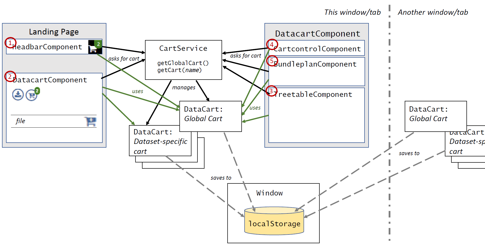

# DatacartModule

This directory provides classes and components implementing the Data Cart Framework.  A data cart
manages a list of files selected by the user from across (potentially) multiple datasets for bulk
download.  Typically, as a user visits different landing pages for different datasets, they can
select files from the dataset and place them in the data cart.  Later, the user can open a view of
the data cart for bulk download: the repository gathers the selected files, packs them in zip
files, and delivers them to the user.  

Internally, the data cart is a list of files selected by the user.  Included with each data file
are not only the corresponding download URL but also other metadata useful for displaying the file
and its download status.  A data cart persists its contents in browser storage so that it can be
returned to during subsequent user sessions.  A cart also provides a watch capability so that
other components can be alerted when its contents or their download statuses change.  Further
more, the cart will monitor its own storage for changes made in other browser windows.  Thus, one
browser tab can contain a view of the data cart while other tabs can contain landing pages from
which the user adds items to the cart.  As they do, views of the cart across the tab remain in
sync.

## Design Overview

### The `DataCart` and the `CartService`

At the center of the data cart framework is the [`DataCart`](cart.ts) class.  It holds a list of
files that have been placed in the cart.  Its key features are:

  *  it provides functions for adding and removing files to and from the cart
  *  the information stored for each file is defined by the [`DataCartItem`](cart.ts) interface;
     it includes:
     *  the `NerdmComp` metadata for the file
     *  the download URL for retrieving the file
     *  its current download status; this property has values that are defined as
        [constants](cartconstants.ts), and include values like "downloading", "donwloaded",
        "failure", etc.
     *  a boolean to indicate if the file is selected for download
  *  The contents of the cart and all the metadata are saved int the browser's local storage via
     the `save()` function; the contents can be brought back into memory via the `restore()` function.
  *  Anytime a client changes the cart's contents, including the status of any of the files, the
     contents are persisted to storage via `save()`.  (The call to `save()` can be delayed to make
     many changes in bulk.)  The cart also watches that storage for changes made in other browser 
     windows; when those changes occur, the `restore()` function is called to load those changes into 
     memory.
  *  Clients of the cart can be alerted to changes in the cart via its `watchForChanges()` function. 
  *  There can be multiple, different carts within the system; each cart has a unique name.  

In the data cart framework, there are two types of carts:
  *  a global cart -- this collects files from across many datasets and landing pages.
  *  a dataset-specific cart -- this contains files only from one dataset; it is created when the
     user selects "download all" on a landing page to download all the files from one dataset.

In order to see a synchronized view of a cart, all clients in the Angular application must hold
the same instance of the `DataCart` class.  To ensure this, clients must get their instance from
a `CartService` instance (provided to it via Angular's normal service injection mechanism).  Its
`getCart()` function allows the client to get the instance by the cart's name; the
`getGlobalCart()` returns the instance of the global cart.  

### Sharing Views of the Cart

Components that want to show information about a cart must use the `DataCart` instance to retrieve
that information, and that instance must be retrieved from the application-injected
`CartService`.  There are two main components that need information about the data cart:

  * the Landing Page, where users can add and remove files to and from a cart, as well as open up
    the cart, and
  * the `DatacartComponent`, where users view the cart contents and download files contained in
    it.

Currently, the `DatacartComponent` is always opened in separate browser tab from the landing
page--that is, in a separate Javascript runtime context.  (This is because downloads can take a
long time, and closing the tab while the downloads are in progress would interrupt them.)
Nevertheless, it is possible to have both components open in the same tab; the interactions at the
`CartService` and `DataCart` interface level are the same.  

Specifically, it is sub-components within these larger components that need access to the cart.
The figure below illustrates which components interact with the data carts.

Here is an inventory of components that need information from or access to a data cart:

Landing Page:

  1. the [`HeadbarComponent`](../frame/headbar.component.ts) includes an icon representing the
     Global Data Cart:
      * the icon displays the number of data files currently in the cart
      * clicking on the icon opens up the a `DatacartComponent` view of the global cart (in a
        separate tab).
  2. The [`DataFilesComponent`](../landing/data-files/data-files.component.ts) component lists
     the files in the dataset; the display includes:
      * an "add all to cart" icon for adding/removing all of the files to and from the global cart:
         * the icon displays the number of files from the dataset that are currently in the cart
         * the color of the cart reflects whether all of the files in the dataset are currently in
           the cart.
         * clicking on the icon adds all of the files from the dataset (not currently in the cart)
           to the global cart; if all of the files are already in the cart; clicking removes them
           all.
      * a "download all" icon that, when clicked, adds all files to a special cart just for this
        dataset (i.e. _not_ the global cart), then opens up the display for this cart (in a
        separate tab), and commences the bulk downloading process.
      * In the listing of the files in the dataset, each row showing a file includes a data cart
        icon for adding and removing it from the Global Data Cart:
         * the color indicates whether that file is currently in the global cart
         * when the user clicks on the icon, the file is added to the cart; if the file is already
           in the cart, the file is removed.
         * when the file is added to the cart, the cart is annotated with the label, "Added".

`DatacartComponent`:
  
  3. [`TreetableComponent`](treecomponent/treecomponent.component.ts) displays the contents of the cart
     * A checkbox by each file listed as in the cart allows the user to select (or unselect) the
       file to be part of a bundled download request.
     * Each row shows the current download status for the file.  If the file is currently being
       downloaded, the name of the zip file it is being bundled into is displayed as well.
  4. [`CartControlComponent`](cartcontrol.component.ts) provides control buttons for operating on
     the cart:
     * It needs to know how many are currently selected.  One button will
       commence downloading them, and another one can remove them from the cart.
     * It needs to know which files have been successfully downloaded (and how many); a button
       allows those files to be removed from the cart.
  5. [`BundleplanComponent`](bundleplan/bundleplan.component.ts) manages the download process
     (triggered via `CartControlComponent` or a "download all" icon-click).
     * As particular data files are bundled into zip bundles, this component updates the download status
       for those files.  It also adds the name of the zip file contain a particular file to the
       metadata saved for that file in the data cart.
     * If a file fails to download, the download status for the file is updated accordingly.

On a related note, there is a download progress meter that appears on landing pages while
downloads are in progress.  This progress is coordinated between the landing page and the
[`BundleplanComponent`](bundleplan/bundleplan.component.ts) separately using the
[`DataCartStatus`](../cartstatus.ts) class.

